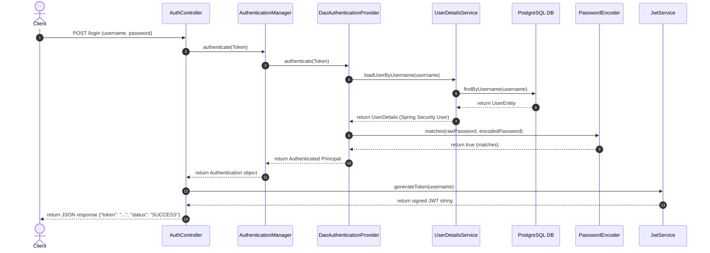
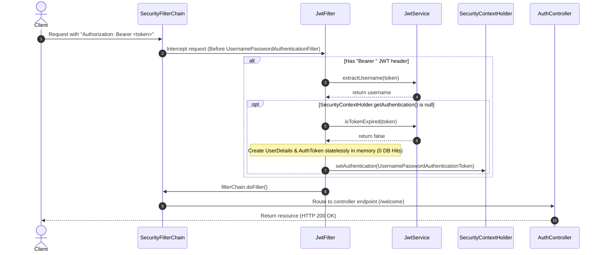

# Stateless JWT Authentication Flow (Zero DB Hits, Custom Authentication Flow) - Crispy Notes

This document details the active, production-ready stateless authentication flow implemented in this codebase, explaining how it enables zero database reads for request validation and validates user credentials programmatically using Spring Security's standard `AuthenticationManager` bean.

---

## 1. Architectural Flows

### A. Login & Token Issuance Flow
This flow executes when a client authenticates by sending credentials to `/login`. It verifies credentials programmatically via the `AuthenticationManager` bean.



---

### B. Request Interception & Stateless Validation Flow
Subsequent calls to protected endpoints (e.g. `/welcome`) intercept the JWT, statelessly build user authentication contexts, and bypass the database entirely.



---

## 2. Architecture Components & Implementation

### A. Persistent User Entity & Repository
The codebase manages database-backed credentials using a lightweight JPA `UserEntity`.
```java
@Data
@Entity
@Table(name = "user_entity")
@NoArgsConstructor
@AllArgsConstructor
public class UserEntity {
    @Id
    private Long id;
    private String username;
    private String password;
}
```

Mapped standard CRUD data accessor interface:
```java
@Repository
public interface UserRepository extends JpaRepository<UserEntity, Long> {
    Optional<UserEntity> findByUsername(String username);
}
```

---

### B. Stateless JWT Interceptor (Bypassing DB Hits)
Parses the validated token and builds a lightweight `UserDetails` in-memory:
```java
@Component
public class JwtFilter extends OncePerRequestFilter {

    @Autowired
    private JwtService jwtService;

    @Override
    protected void doFilterInternal(
            @NonNull HttpServletRequest request,
            @NonNull HttpServletResponse response,
            @NonNull FilterChain filterChain
    ) throws ServletException, IOException {
        final String authHeader = request.getHeader("Authorization");
        final String jwt;
        final String username;

        if (authHeader == null || !authHeader.startsWith("Bearer ")) {
            filterChain.doFilter(request, response);
            return;
        }

        jwt = authHeader.substring(7);
        username = jwtService.extractUsername(jwt);

        if (username != null && SecurityContextHolder.getContext().getAuthentication() == null) {
            // Verify signature & expiration statelessly
            if (!jwtService.isTokenExpired(jwt)) {
                // Reconstruct UserDetails directly in-memory (0 DB reads)
                UserDetails userDetails = org.springframework.security.core.userdetails.User.builder()
                        .username(username)
                        .password("") // Password is not required statelessly
                        .authorities(Collections.emptyList()) // No RBAC roles required
                        .build();

                UsernamePasswordAuthenticationToken authToken = new UsernamePasswordAuthenticationToken(
                        userDetails,
                        null,
                        Collections.emptyList()
                );
                authToken.setDetails(new WebAuthenticationDetailsSource().buildDetails(request));
                SecurityContextHolder.getContext().setAuthentication(authToken);
            }
        }
        filterChain.doFilter(request, response);
    }
}
```

---

### C. Truly RESTful Custom Security Configuration
Disables stateful features (like CSRF, cookies, and standard generated sign-in forms) and registers the custom JWT filter and programmatically maps the standard `AuthenticationManager` bean:
```java
@Configuration
@EnableWebSecurity
public class SecurityConfig {

    @Autowired
    private UserRepository repo;

    @Autowired
    private JwtFilter jwtFilter;

    @Bean
    public UserDetailsService userDetailsService() {

        return username -> {

            UserEntity user = repo.findByUsername(username)
                    .orElseThrow(() ->
                        new UsernameNotFoundException(
                            "User Not Found"
                        )
                    );

            return User.builder()
                    .username(user.getUsername())
                    .password(user.getPassword())
                    .roles("USER")
                    .build();
        };
    }

    @Bean
    public PasswordEncoder passwordEncoder() {
        return new BCryptPasswordEncoder();
    }

    @Bean
    public AuthenticationManager authenticationManager() {

        DaoAuthenticationProvider provider =
                new DaoAuthenticationProvider();

        provider.setUserDetailsService(
                userDetailsService()
        );

        provider.setPasswordEncoder(
                passwordEncoder()
        );

        return new ProviderManager(provider);
    }

    @Bean
    public SecurityFilterChain securityFilterChain(
            HttpSecurity http) throws Exception {

        http
            .csrf(csrf -> csrf.disable())

            .authorizeHttpRequests(auth -> auth
                    .requestMatchers("/login").permitAll()
                    .anyRequest().authenticated()
            )

            .exceptionHandling(ex -> ex
                    .authenticationEntryPoint((request, response, authException) -> {
                        // Send 401 Unauthorized instead of standard redirect
                        response.sendError(HttpServletResponse.SC_UNAUTHORIZED, "Unauthorized");
                    })
            )

            .sessionManagement(session -> session
                    .sessionCreationPolicy(SessionCreationPolicy.STATELESS)
            )

            .addFilterBefore(jwtFilter, UsernamePasswordAuthenticationFilter.class);

        return http.build();
    }
}
```

---

### D. JWT Issuance & Verification Controller
Validates user credentials programmatically using Spring Security's standard `AuthenticationManager` bean and returns signed JWT access tokens:
```java
@RestController
public class AuthController {

    @Autowired
    private AuthenticationManager authManager;

    @Autowired
    private JwtService jwtService;

    @PostMapping("/login")
    public Map<String, String> login(
            @RequestBody LoginRequest req) {

        Authentication authentication =
                authManager.authenticate(
                    new UsernamePasswordAuthenticationToken(
                        req.getUsername(),
                        req.getPassword()
                    )
                );

        String token = jwtService.generateToken(req.getUsername());
        Map<String, String> response = new HashMap<>();
        response.put("token", token);
        response.put("status", "LOGIN SUCCESS");
        return response;
    }

    @GetMapping("/welcome")
    public String welcome(Authentication authentication) {
        // Extract the username statelessly from the JWT authentication context
        return "Welcome, " + authentication.getName() + "!";
    }
}
```

---

## 3. Architectural Comparison & Tradeoffs

| Pros | Cons |
| :--- | :--- |
| **0 Database Hits** on all request mappings (yielding high throughput). | Token revocation requires storing a stateless blocklist (e.g. in Redis). |
| True REST design (no cookies or form login redirections). | Requires client application to store the token (e.g. in local storage). |
| Standard robust Spring Security pipeline configured during `/login` phase. | More configuration classes to maintain compared to direct JPA logins. |
| Perfect for highly scaled REST microservices and SPAs. | Crypographic secret key must be rotated and managed securely. |
