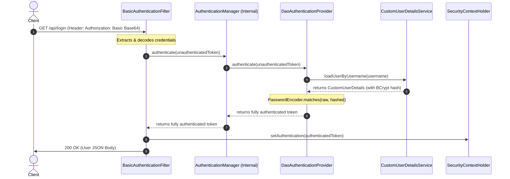

# The Role of AuthenticationManager: HTTP Basic vs. Custom JWT

This document explains the inner workings of Spring Security's `AuthenticationManager`, comparing how it is utilized in **HTTP Basic Authentication** versus custom **JSON Web Token (JWT)** configurations, and why the explicit `@Bean` definition was removed from our configuration.

---

## 1. Overview of `AuthenticationManager`

The `AuthenticationManager` is the core orchestrator of credential validation in Spring Security. It has a simple but powerful interface:

```java
public interface AuthenticationManager {
    Authentication authenticate(Authentication authentication) throws AuthenticationException;
}
```

* **Input**: An *unauthenticated* `Authentication` token (e.g., containing raw username and password).
* **Output**: A *fully authenticated* `Authentication` token (containing the principal, granted authorities, and credentials cleared).

---

## 2. Comparison: JWT (Manual) vs. HTTP Basic (Automated)

### 2.1 Custom JWT Setup (Manual Invocation)
In a custom JWT or JSON login setup, the framework does not natively know how to extract your credentials from custom REST endpoints (like `/authenticate` or `/login` POST bodies). 

Therefore, you must write manual code to load the credentials, trigger the validation, and register the manager:

```
[Client Request]
       │ (POST /login with JSON Body)
       ▼
 [RestController / Filter]  ◄─── Requires manual @Autowired of AuthenticationManager
       │
       ├─► 1. Read JSON username and password
       ├─► 2. Create UsernamePasswordAuthenticationToken(user, pass)
       └─► 3. Call authenticationManager.authenticate(token)
```

* **Why the `@Bean` was required**: Since your controllers or custom filters explicitly need to inject the `AuthenticationManager` using `@Autowired`, you had to declare a public `@Bean` in your configuration to expose it:
  ```java
  @Bean
  public AuthenticationManager authenticationManager(AuthenticationConfiguration config) throws Exception {
      return config.getAuthenticationManager();
  }
  ```

---

### 2.2 HTTP Basic Setup (Automated Interception)
In **HTTP Basic Authentication**, the built-in **`BasicAuthenticationFilter`** intercepts the request and handles all standard flow steps automatically.



1. **Extraction**: The request arrives with an `Authorization: Basic <base64>` header. `BasicAuthenticationFilter` intercepts it and decodes the credentials.
2. **Internal Delegation**: The filter automatically grabs the internal `AuthenticationManager` instance built into `HttpSecurity` and calls it:
   ```java
   this.authenticationManager.authenticate(authRequest);
   ```
3. **Validation**: The internal manager delegates to `DaoAuthenticationProvider`, which runs your `CustomUserDetailsService` (to look up the database user) and validates the password using the registered `PasswordEncoder` (`BCryptPasswordEncoder`).
4. **Context Propagation**: Once verified, the filter registers the fully authenticated token inside the `SecurityContextHolder`.

* **Why we deleted the `@Bean`**: Since the built-in `BasicAuthenticationFilter` obtains the manager internally through the `HttpSecurity` builder DSL, you no longer have custom classes or controllers calling it manually. Thus, exposing it as a public `@Bean` is redundant and can be safely removed.

---

## 3. Key Takeaway

| Aspect | JWT / Custom JSON Login | HTTP Basic Authentication |
| :--- | :--- | :--- |
| **Who Extracts Credentials?** | Custom REST Controller or Custom Filter | Built-in `BasicAuthenticationFilter` |
| **Is `AuthenticationManager` Used?** | **Yes** (Invoked manually in code) | **Yes** (Invoked automatically by the filter) |
| **Explicit `@Bean` Needed?** | **Yes** (Needed for `@Autowired` injection) | **No** (Framework builds and injects it internally) |
| **Authentication Source** | Custom payload (e.g. JSON Request Body) | `Authorization` Request Header |
