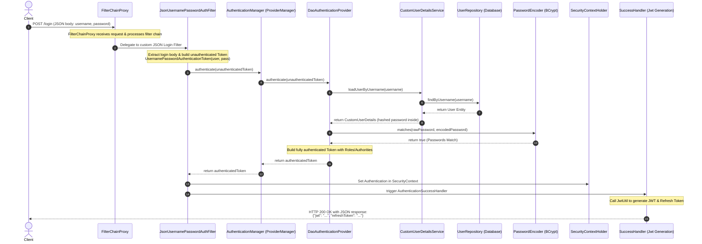
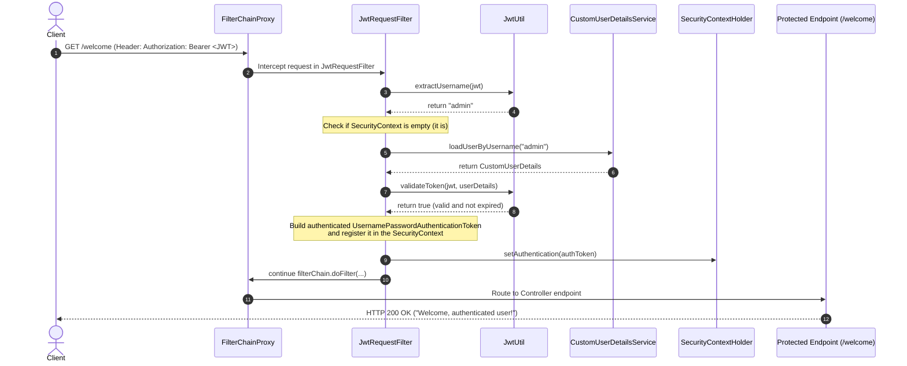

# Spring Security Component-Based (Bean-Centric) Authentication Flow

This document details the modern, bean-centric (**"Component-Based"** or **`use-components`**) authentication flow in Spring Security 6.x / Spring Boot 3.x, tracing how requests are processed, authenticated, and authorized using standalone component beans instead of deprecated configuration inheritance patterns (`WebSecurityConfigurerAdapter`).

---

## 1. Overview of the Component-Based Architecture

In modern Spring Security, we configure security declaratively by registering standalone `@Bean` definitions rather than overriding methods in a configuration class. The core components of this architecture are:

| Component | Class / Interface | Responsibility |
| :--- | :--- | :--- |
| **Security Filter Chain** | `SecurityFilterChain` | Declares the ordered chain of filters to intercept and process incoming requests. |
| **Authentication Manager** | `AuthenticationManager` | The core entry point for validating credential tokens. Injected into controllers or filters. |
| **User Details Service** | `UserDetailsService` | Loads user-specific data from a database or storage. |
| **Password Encoder** | `PasswordEncoder` | Encodes and verifies credentials using cryptographically secure hashing (e.g., BCrypt). |
| **JWT Filter** | `OncePerRequestFilter` | Custom filter that intercepts every incoming request, validates Bearer JWT tokens, and seeds the security context. |
| **JSON Auth Filter** | `UsernamePasswordAuthenticationFilter` | Custom filter designed to intercept `/login` POST requests containing JSON-encoded credentials. |

---

## 2. Authentication Flow Diagram

Here is the sequential flow of authentication, from credentials submission to JWT issuance:



---

## 3. Step-by-Step Execution Walkthrough

### Step A: Submitting Credentials
The client sends a `POST` request to `/login` with a JSON payload:
```json
{
  "username": "admin",
  "password": "password"
}
```

### Step B: The Filter Interception
1. The **`FilterChainProxy`** (which manages the list of security filters in `SecurityFilterChain`) routes the request to our custom **`JsonUsernamePasswordAuthFilter`**.
2. **`attemptAuthentication(request, response)`** is invoked:
   - Reads the input stream using Jackson `ObjectMapper` and binds it to `AuthRequest.class`.
   - Creates an **unauthenticated** `UsernamePasswordAuthenticationToken` using the supplied credentials.
   - Delegates authentication to the **`AuthenticationManager`**:
     ```java
     return authenticationManager.authenticate(authToken);
     ```

### Step C: Resolving the Authentication
1. The `AuthenticationManager` (typically `ProviderManager`) queries its registered `AuthenticationProvider`s. For basic username/password, it uses the **`DaoAuthenticationProvider`**.
2. **`DaoAuthenticationProvider`** interacts with the database:
   - Calls **`CustomUserDetailsService.loadUserByUsername(username)`**.
   - `CustomUserDetailsService` fetches the user record from the database using **`UserRepository`**.
   - It packages the user into a **`CustomUserDetails`** wrapper (implementing Spring Security's `UserDetails`) and returns it.
3. The provider calls **`PasswordEncoder.matches(raw, encoded)`**:
   - Computes the BCrypt hash of the incoming password and compares it to the database record.
   - If they match, a new **authenticated** `UsernamePasswordAuthenticationToken` is created, passing the `UserDetails` and their associated authorities (`roles`).

### Step D: Authentication Success Handler & Token Generation
Upon successful authentication, control is handed over to the success handler defined in **`SecurityConfig`**:
```java
filter.setAuthenticationSuccessHandler((req, res, auth) -> {
    UserDetails userDetails = (UserDetails) auth.getPrincipal();
    String token = jwtUtil.generateToken(userDetails);
    String refreshToken = jwtUtil.generateRefreshToken(userDetails);
    res.setContentType("application/json");
    res.getWriter().write("{\"jwt\": \"" + token + "\", \"refreshToken\": \"" + refreshToken + "\"}");
});
```
This generates and returns the JWT and Refresh tokens back to the user, completely stateless.

---

## 4. Stateless JWT Requests Flow (Authorization)

Once the user is authenticated and has received the tokens, all subsequent requests contain the token in the headers: `Authorization: Bearer <JWT>`.



### Key Security Guardrails in `JwtRequestFilter`
* **OncePerRequestFilter**: Ensures this validation only happens once per request cycle.
* **SecurityContext Check**: Before calling user details, it checks `SecurityContextHolder.getContext().getAuthentication() == null` to prevent redundant work if the context is already authenticated.
* **Exception Isolation**: Catching errors while extracting claims ensures that an invalid or tempered token doesn't break the application, but instead results in a clean access denial downstream (401 Unauthorized).
