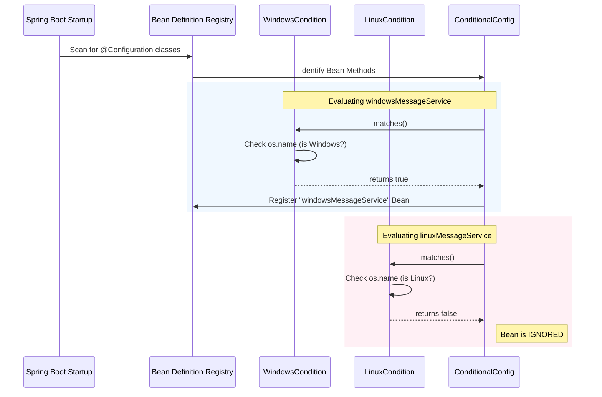

# @Conditional: OS-Based Bean Selection Flow

This note explains the flow and implementation of selecting different beans based on the Operating System using Spring's `@Conditional` annotation.

## 1. Implementation Components

### A. The Conditions
These classes check the system environment at startup.
- **`WindowsCondition`**: Returns `true` if `os.name` contains "Windows".
- **`LinuxCondition`**: Returns `true` if `os.name` contains "Linux".

### B. The Service
A simple interface `MessageService` with two implementations:
- `WindowsMessageService`
- `LinuxMessageService`

### C. The Configuration
The magic happens here using the `@Conditional` annotation:

```java
@Configuration
public class ConditionalConfig {

    @Bean
    @Conditional(WindowsCondition.class)
    public MessageService windowsMessageService() {
        return new WindowsMessageService();
    }

    @Bean
    @Conditional(LinuxCondition.class)
    public MessageService linuxMessageService() {
        return new LinuxMessageService();
    }
}
```

---

## 2. Visual Execution Flow



---

## 3. Step-by-Step Flow Description

1.  **Context Initialization**: During startup, Spring Boot scans all classes marked with `@Configuration`.
2.  **Condition Checking**: For every method marked with `@Bean` and `@Conditional(Condition.class)`:
    *   Spring instantiates the specified `Condition` class.
    *   It calls the `matches(ConditionContext context, AnnotatedTypeMetadata metadata)` method.
3.  **The "Return" Decision**:
    *   The `matches()` method must return a **boolean**.
    *   If **`true`**: The method is executed, and the returned object is registered as a Spring Bean.
    *   If **`false`**: The method is skipped entirely. No bean is created.
4.  **Injection**: When other components (like a Controller) ask for a `MessageService` bean via `@Autowired`, Spring looks into the registry and finds the one that was successfully created (e.g., the Windows version).
5.  **Runtime**: At runtime, the application only "sees" the bean that matched the condition. The other implementation doesn't even exist in the application's memory.
