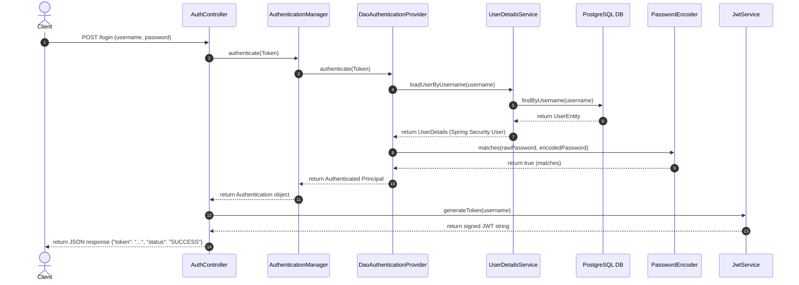
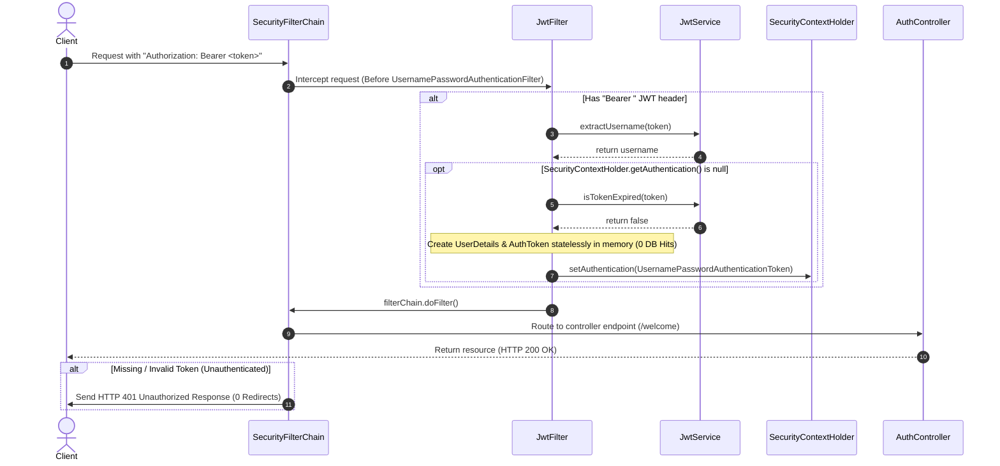

# Pure Stateless JWT Security Flow (No DB Hits, Custom Authentication Flow)

This document details the optimized architectural flow for programmatically authenticating users and validating subsequent requests statelessly in our Spring Security configuration, avoiding database calls and form login redirects on protected paths.

---

## 1. Login & Token Issuance Flow

This flow executes when a client authenticates by sending credentials to `/login`. It validates credentials using Spring Security's standard `AuthenticationManager` bean.

### Flow Diagram

### Steps in Detail
1. **Request Submission**: The client sends a `POST` request to `/login` containing the `username` and `password` inside a JSON body.
2. **Controller Interception**: The `AuthController` receives the `LoginRequest` DTO and wraps the credentials into an unauthenticated `UsernamePasswordAuthenticationToken`.
3. **Manager Delegation**: `AuthenticationManager` (configured as a `ProviderManager`) receives the token and forwards it to the registered `DaoAuthenticationProvider`.
4. **User Retrieval**: The provider requests user details from the custom `UserDetailsService` bean.
5. **Database Query**: `UserDetailsService` queries the PostgreSQL database via `UserRepository` searching for a matching `UserEntity`.
6. **Password Verification**: The provider uses `BCryptPasswordEncoder` to match the raw incoming password against the database-stored hashed password.
7. **Security Context Creation**: Upon successful match, an authenticated principal is returned up to the `AuthController`.
8. **JWT Generation**: `AuthController` invokes the `JwtService` to construct and HMAC-SHA256 sign a new JWT token containing the username as the subject.
9. **JSON Response**: The signed token is returned back to the client in a JSON map.

---

## 2. Protected Request Flow (Stateless Verification)

This flow executes for every subsequent request targeting authenticated resources (e.g., `/welcome`), requiring the token to be sent in the `Authorization: Bearer <token>` HTTP header.

### Flow Diagram

### Steps in Detail
1. **Header Inspection**: `JwtFilter` checks the incoming request's `Authorization` header. If it is missing or does not start with `"Bearer "`, the request is passed through the remaining filter chain.
2. **Subject Extraction**: The token is parsed, and `JwtService` extracts the subject (`username`) by cryptographically verifying the signature.
3. **Security Context Check**: If the username is successfully extracted and no authentication token is already registered in `SecurityContextHolder`, token validation begins.
4. **Validation Check**: `JwtService` verifies that the token has not expired.
5. **Stateless Reconstitution**: A lightweight `UserDetails` representation and authenticated `UsernamePasswordAuthenticationToken` containing an empty authority list (no RBAC) are created **entirely in memory**, bypassing database queries completely.
6. **Security Context Injected**: The filter sets the authenticated token inside the standard `SecurityContextHolder`.
7. **Stateless Request Processing**: The request completes downstream and is processed by the mapped `RestController` class returning the final response.
8. **RESTful Exception Handling**: If the request is unauthenticated, instead of redirecting the user to a login web form, Spring Security invokes the `AuthenticationEntryPoint` which responds directly with an **HTTP 401 Unauthorized** error.
