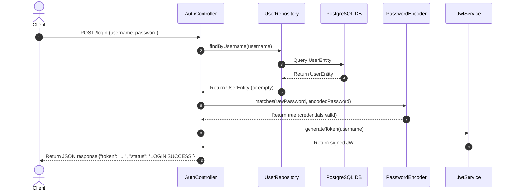
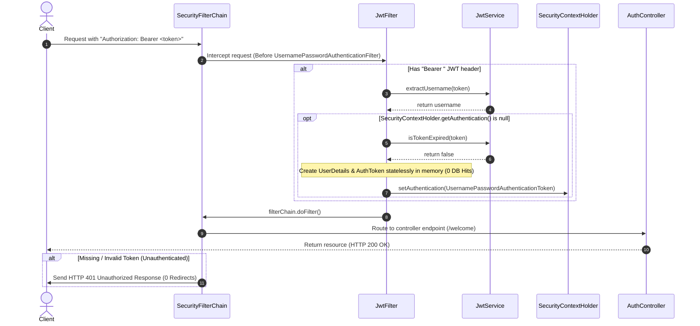

# Pure Stateless JWT Security Flow (No DB Hits, Direct Controller Auth)

This document details the optimized architectural flow for programmatically authenticating users and validating subsequent requests statelessly in our Spring Security configuration, avoiding both database calls, form login redirects, and authentication manager boilerplates.

---

## 1. Login & Token Issuance Flow

This flow executes when a client authenticates by sending their credentials to the custom POST `/login` endpoint. It performs direct repository checks and bypasses the heavy `AuthenticationManager` and `SecurityContextHolder` during login.

### Flow Diagram

### Steps in Detail
1. **Request Submission**: The client sends a `POST` request to `/login` containing the `username` and `password` inside a JSON body.
2. **JPA Lookup**: `AuthController` receives the request and directly calls `UserRepository.findByUsername(username)` to query the database.
3. **Database Fetch**: The repository retrieves the `UserEntity` from the PostgreSQL database.
4. **Password Match**: `AuthController` uses `BCryptPasswordEncoder.matches()` to verify the raw password hash against the stored database hash.
5. **JWT Issuance**: Upon successful verification, the controller invokes `JwtService.generateToken()` to construct and sign a new JWT token.
6. **Stateless Response**: The signed token is returned back to the client in a JSON payload. No session is created, and the `SecurityContextHolder` is **not** mutated during login.

---

## 2. Protected Request Flow (Stateless Verification)

This flow executes for every subsequent request targeting authenticated resources (e.g., `/welcome`), requiring the token to be sent in the `Authorization: Bearer <token>` HTTP header.

### Flow Diagram

### Steps in Detail
1. **Header Inspection**: `JwtFilter` checks the incoming request's `Authorization` header. If it is missing or does not start with `"Bearer "`, the request is passed through the remaining filter chain.
2. **Subject Extraction**: The token is parsed, and `JwtService` extracts the subject (`username`) by cryptographically verifying the signature.
3. **Security Context Check**: If the username is successfully extracted and no authentication token is already registered in `SecurityContextHolder`, token validation begins.
4. **Validation Check**: `JwtService` verifies that the token has not expired.
5. **Stateless Reconstitution**: A lightweight `UserDetails` representation and authenticated `UsernamePasswordAuthenticationToken` containing an empty authority list (no RBAC) are created **entirely in memory**, bypassing database queries completely.
6. **Security Context Injected**: The filter sets the authenticated token inside the standard `SecurityContextHolder`.
7. **Stateless Request Processing**: The request completes downstream and is processed by the mapped `RestController` class returning the final response.
8. **RESTful Exception Handling**: If the request is unauthenticated, instead of redirecting the user to a login web form, Spring Security invokes the `AuthenticationEntryPoint` which responds directly with an **HTTP 401 Unauthorized** error.
