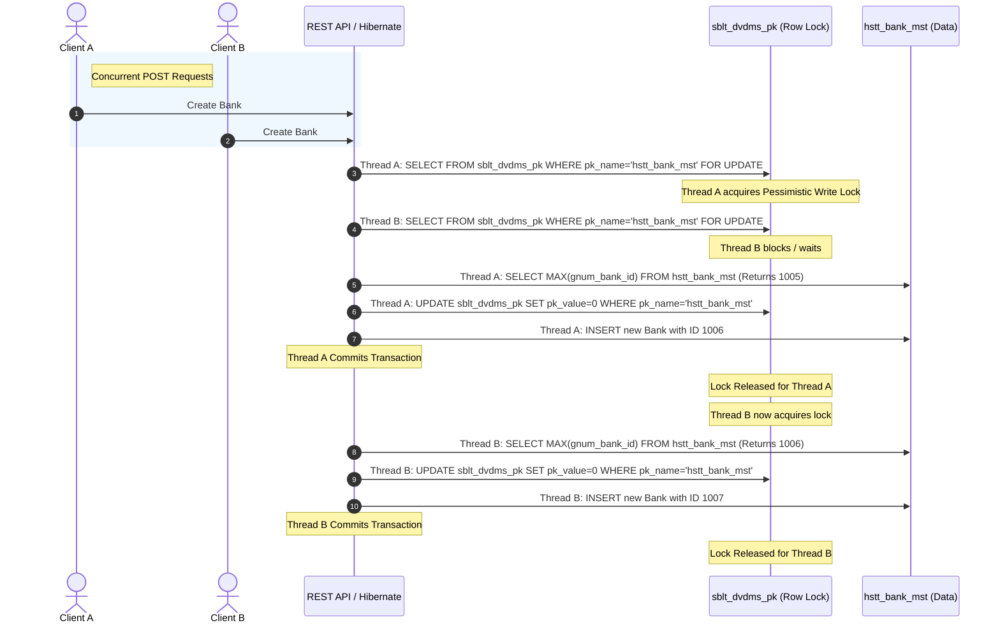

# DVDMS Primary Key Locking Mechanism Step-by-Step

This document explains the pessimistic row-locking primary key generation mechanism implemented in `DvdmsIdGenerator` using `SbltDvdmsPk` (the `sblt_dvdms_pk` pattern) and its application in a stateless Spring Boot REST API.

---

## 1. The Core Concepts

### A. HTTP Session vs. Hibernate Session
It is critical to distinguish between these two terms:
* **HTTP Session**: Used in stateful web applications to store client information across multiple web page requests (e.g. tracking who is logged in). Stateless REST APIs **do not** use HTTP sessions.
* **Hibernate Session (`SharedSessionContractImplementor`)**: Represents the active database connection and transaction context. Every database operation—even in a stateless REST API—must run through a Hibernate/JPA session.

### B. The Problem: Concurrency without Locking
Without locking, two concurrent requests to create an entity (e.g., Bank) at the same millisecond will perform the following steps:
1. **Thread A** executes: `SELECT MAX(id) FROM hstt_bank_mst` (receives `1005`).
2. **Thread B** executes: `SELECT MAX(id) FROM hstt_bank_mst` (receives `1005` because Thread A hasn't committed yet).
3. **Thread A** sets ID to `1006` and inserts.
4. **Thread B** sets ID to `1006` and inserts.
5. **Database Error**: Thread B's insert fails with a `DuplicateKeyException` (Primary Key Constraint Violation).

---

## 2. The Solution: Mutex Row-Locking (`sblt_dvdms_pk`)

To solve the concurrency issue, we introduce a lock-mutex table `sblt_dvdms_pk` containing rows representing entities (e.g. `hstt_bank_mst`). The generator serializes key-generation requests using database row-level locking.



---

## 3. Step-by-Step Execution Details in Code

Here is the exact code flow inside `DvdmsIdGenerator.generatePk(...)`:

### Step 1: Acquire the Row-Level Lock
```java
session.getNamedQuery("selectPk")
       .setParameter("pkName", queryName)
       .setLockOptions(LockOptions.UPGRADE)
       .uniqueResult();
```
* **What it does**: This executes the NamedQuery `selectPk` defined in `SbltDvdmsPk`.
* **The SQL generated**: `SELECT pk_value FROM sblt_dvdms_pk WHERE pk_name = ? FOR UPDATE`.
* **Implication**: The database locks the row representing the current entity sequence. No other transaction can acquire this lock until the current transaction commits or rolls back.

### Step 2: Fetch the Maximum Primary Key
```java
Query<?> queryObj = session.getNamedQuery(queryName);
if (params != null) {
    for (Map.Entry<String, Object> entry : params.entrySet()) {
        queryObj.setParameter(entry.getKey(), entry.getValue());
    }
}
Object result = queryObj.uniqueResult();
```
* **What it does**: Resolves the NamedQuery configured on the entity (e.g. `select coalesce(max(c.gnumBankId), 1000) + 1 from HsttBankMst...`).
* **Why it is safe now**: Since we have locked the corresponding row in the mutex table, no other concurrent request can read the maximum ID at the same time. The max ID returned is guaranteed to be unique and safe to use.

### Step 3: Perform a Dummy Update
```java
session.getNamedQuery("updatePk")
       .setParameter("pkValue", 0)
       .setParameter("pkName", queryName)
       .executeUpdate();
```
* **What it does**: Executes an update statement on the locked row in `sblt_dvdms_pk`.
* **Implication**: This ensures the database logs a write operation for the current transaction, preventing read-only connection optimizations and cementing the write intent in the database transaction log.

### Step 4: Return the Generated ID
```java
if (result instanceof Number) {
    return ((Number) result).intValue();
}
return 1001;
```
* **What it does**: Checks and returns the generated integer key value. Hibernate uses this return value as the ID for the `INSERT` SQL statement.

---

## 4. Key Advantages of This Strategy

1. **Thread-Safe and Process-Safe**: Because the lock is held inside the database engine, it works even when your REST API is scaled horizontally across multiple servers or JVMs.
2. **Stateless Compliance**: No in-memory locks or JVM state are maintained, keeping the Spring Boot application server completely stateless.
3. **Pessimistic Control**: Resolves concurrency issues before data insertion, avoiding database constraint failures and transaction rollbacks.
