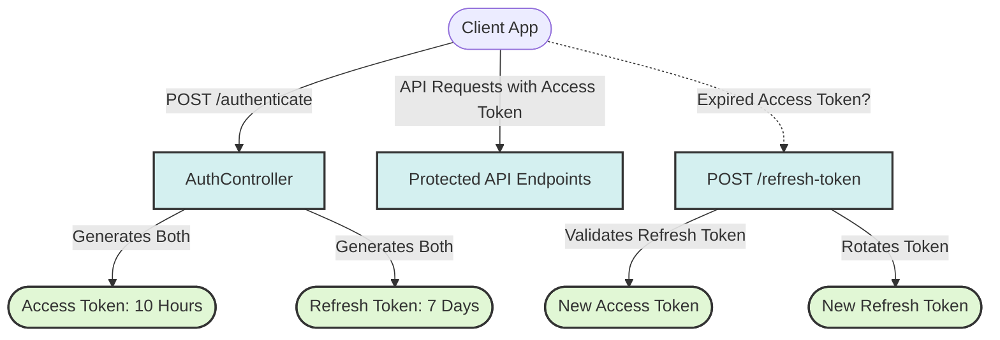

# JWT Security Configuration and Token Management

This document details the JSON Web Token (JWT) architecture, utilities, and endpoints implemented in the Spring Boot application using the component-based security design.

---

## 1. Stateless Authentication Model (JWT vs Session)

Traditional web applications use stateful sessions, where the server stores session data in memory and tracks it via a `JSESSIONID` cookie. 

For RESTful microservices or modern client-server architectures, statelessness is preferred. We enforce this using Spring Security components in `SecurityConfig.java`:

```java
.sessionManagement(session -> session.sessionCreationPolicy(SessionCreationPolicy.STATELESS))
```

### The JWT Protocol
Instead of storing state on the server, the server generates a cryptographically signed token (JWT) containing user claims and returns it to the client. The client attaches this token in the header of every future request:

```http
Authorization: Bearer <Access_Token>
```

---

## 2. Deep Dive into `JwtUtil.java`

Our `JwtUtil` component handles token generation, claim parsing, and validation using the **JJWT (Java JWT)** library.

### 2.1 Token Construction
A JSON Web Token consists of three parts separated by dots (`.`):
1. **Header**: Contains the hashing algorithm (e.g., HS256).
2. **Payload (Claims)**: Statements about the user (e.g., subject/username, issue date, expiration date).
3. **Signature**: Validates that the sender of the JWT is who it claims to be and ensures the message wasn't tampered with.

Our implementation signs the token using an HMAC SHA-256 key:
```java
private String createToken(Map<String, Object> claims, String subject, long expirationTime) {
    return Jwts.builder()
            .setClaims(claims)
            .setSubject(subject)
            .setIssuedAt(new Date(System.currentTimeMillis()))
            .setExpiration(new Date(System.currentTimeMillis() + expirationTime))
            .signWith(Keys.hmacShaKeyFor(SECRET_KEY.getBytes()), SignatureAlgorithm.HS256)
            .compact();
}
```

### 2.2 Token Validation Guardrails
To prevent security leaks, the token is verified on every API request.
```java
public boolean validateToken(String token, UserDetails userDetails) {
    final String username = extractUsername(token);
    return (username.equals(userDetails.getUsername()) && !isTokenExpired(token));
}
```
Validation ensures:
1. **Identity Integrity**: The username in the JWT matches the authenticated user in the system context.
2. **Expiration Integrity**: The token has not expired (`isTokenExpired` checks the `exp` claim against current server time).
3. **Signature Integrity**: If anyone alters even a single character of the payload, the signature check fails immediately, throwing a parsing exception.

---

## 3. Token Lifecycle & Rotation Strategy

Our implementation utilizes a multi-token paradigm: **Short-lived Access Tokens** paired with **Long-lived Refresh Tokens**.



### 3.1 Expirations Defined
* **Access Token**: Lasts **10 hours** (customizable). It is used for all routine API operations.
* **Refresh Token**: Lasts **7 days**. It is stored securely (e.g., HTTPOnly Cookies or Secure Storage) and is only transmitted when obtaining a new Access Token.

### 3.2 Token Rotation Setup (`/refresh-token`)
To mitigate replay attacks, we employ **Token Rotation**. When a client refreshes an access token, we issue both a new access token *and* a new refresh token, invalidating the old refresh token:

```java
@PostMapping("/refresh-token")
public ResponseEntity<?> refreshToken(@RequestBody RefreshTokenRequest refreshRequest) throws Exception {
    String refreshToken = refreshRequest.getRefreshToken();
    String username = jwtUtil.extractUsername(refreshToken);
    UserDetails userDetails = userDetailsService.loadUserByUsername(username);

    if (jwtUtil.validateToken(refreshToken, userDetails)) {
        String newAccessToken = jwtUtil.generateToken(userDetails);
        // Generate new refresh token (ROTATION)
        final String newRefreshToken = jwtUtil.generateRefreshToken(userDetails);
        return ResponseEntity.ok(new AuthResponse(newAccessToken, newRefreshToken));
    } else {
        throw new Exception("Invalid Refresh Token");
    }
}
```
This restricts the window of opportunity if a refresh token is ever compromised.
