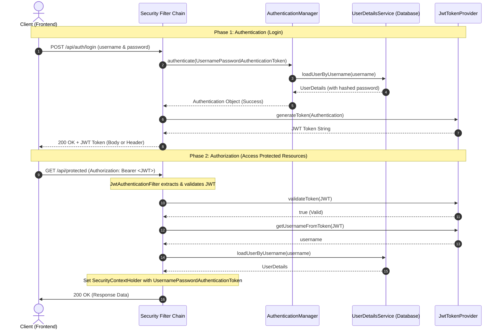

# Basic JWT Security Configuration in Spring Boot

This document provides a comprehensive overview of the basic security configuration for JSON Web Token (JWT) authentication in a Spring Boot application, focusing on username/password validation and the required components.

---

## 1. High-Level Architecture Flow

The standard JWT authentication flow consists of two main phases: **Authentication (Login)** and **Authorization (Subsequent Requests)**.



---

## 2. Core Components Explained

To implement JWT authentication in Spring Boot, the following components are essential:

### A. `JwtTokenProvider` (or `JwtUtils`)
A utility class responsible for operations related to the JSON Web Token.
* **Generate Token:** Builds a JWT with claims (subject/username, issued at, expiration date) and signs it using a secret key and signature algorithm (e.g., HS512).
* **Validate Token:** Checks if the token is signature-valid, not expired, and structurally correct.
* **Get Subject:** Extracts the username or subject from the validated token claims.

### B. `JwtAuthenticationFilter` (Custom Request Filter)
Extends `OncePerRequestFilter` to intercept every incoming HTTP request.
* Extracts the token from the `Authorization` HTTP header (typically starts with `Bearer `).
* Validates the token using the `JwtTokenProvider`.
* If valid, loads the user details via `UserDetailsService`, builds an `UsernamePasswordAuthenticationToken` authentication object, and injects it into the Spring Security context (`SecurityContextHolder.getContext().setAuthentication(...)`).

### C. `UserDetailsService` & `UserDetails`
Core Spring Security interfaces used to load user-specific data.
* **`UserDetails`:** Represents the authenticated principal (user) and contains authorities, password, and active status.
* **`UserDetailsService`:** Defines the single method `loadUserByUsername(String username)`. Custom implementations fetch the user from a database or storage.

### D. `SecurityConfig` (Security Filter Chain Configuration)
The heart of Spring Security configuration. In modern Spring Security (Spring Boot 3.x), we define a `SecurityFilterChain` bean:
* **Stateless Session Management:** Configures `SessionCreationPolicy.STATELESS` because JWTs do not require server-side sessions.
* **CORS & CSRF:** Disables CSRF (not needed for stateless JWT APIs) and configures CORS.
* **Endpoint Authorization:** Specifies which endpoints are public (e.g., `/api/auth/**`) and which require authentication.
* **Filter Registration:** Injects `JwtAuthenticationFilter` and inserts it before `UsernamePasswordAuthenticationFilter`.
* **Beans Configuration:** Registers `AuthenticationManager` and `PasswordEncoder` (such as `BCryptPasswordEncoder`).

### E. `AuthEntryPointJwt` (Authentication Entry Point)
Implements `AuthenticationEntryPoint` to handle unauthorized access attempts. It returns a `401 Unauthorized` HTTP response containing a descriptive error message when a user tries to access a protected resource without a valid token.

---

## 3. Basic Code Reference

Here is a standard configuration implementation using modern **Spring Boot 3.x** and **Spring Security 6.x** practices.

### SecurityConfig.java
```java
package com.example.security.config;

import com.example.security.jwt.AuthEntryPointJwt;
import com.example.security.jwt.JwtAuthenticationFilter;
import org.springframework.context.annotation.Bean;
import org.springframework.context.annotation.Configuration;
import org.springframework.security.authentication.AuthenticationManager;
import org.springframework.security.authentication.dao.DaoAuthenticationProvider;
import org.springframework.security.config.annotation.authentication.configuration.AuthenticationConfiguration;
import org.springframework.security.config.annotation.web.builders.HttpSecurity;
import org.springframework.security.config.annotation.web.configuration.EnableWebSecurity;
import org.springframework.security.config.http.SessionCreationPolicy;
import org.springframework.security.core.userdetails.UserDetailsService;
import org.springframework.security.crypto.bcrypt.BCryptPasswordEncoder;
import org.springframework.security.crypto.password.PasswordEncoder;
import org.springframework.security.web.SecurityFilterChain;
import org.springframework.security.web.authentication.UsernamePasswordAuthenticationFilter;

@Configuration
@EnableWebSecurity
public class SecurityConfig {

    private final UserDetailsService userDetailsService;
    private final AuthEntryPointJwt unauthorizedHandler;
    private final JwtAuthenticationFilter jwtAuthenticationFilter;

    public SecurityConfig(UserDetailsService userDetailsService, 
                          AuthEntryPointJwt unauthorizedHandler, 
                          JwtAuthenticationFilter jwtAuthenticationFilter) {
        this.userDetailsService = userDetailsService;
        this.unauthorizedHandler = unauthorizedHandler;
        this.jwtAuthenticationFilter = jwtAuthenticationFilter;
    }

    @Bean
    public PasswordEncoder passwordEncoder() {
        return new BCryptPasswordEncoder();
    }

    @Bean
    public DaoAuthenticationProvider authenticationProvider() {
        DaoAuthenticationProvider authProvider = new DaoAuthenticationProvider();
        authProvider.setUserDetailsService(userDetailsService);
        authProvider.setPasswordEncoder(passwordEncoder());
        return authProvider;
    }

    @Bean
    public AuthenticationManager authenticationManager(AuthenticationConfiguration authConfig) throws Exception {
        return authConfig.getAuthenticationManager();
    }

    @Bean
    public SecurityFilterChain filterChain(HttpSecurity http) throws Exception {
        http.csrf(csrf -> csrf.disable())
            .exceptionHandling(exception -> exception.authenticationEntryPoint(unauthorizedHandler))
            .sessionManagement(session -> session.sessionCreationPolicy(SessionCreationPolicy.STATELESS))
            .authorizeHttpRequests(auth -> auth
                .requestMatchers("/api/auth/**").permitAll() // Public login/register endpoints
                .anyRequest().authenticated()               // All other endpoints require authentication
            );

        http.authenticationProvider(authenticationProvider());
        
        // Add custom JWT filter before the standard username/password filter
        http.addFilterBefore(jwtAuthenticationFilter, UsernamePasswordAuthenticationFilter.class);

        return http.build();
    }
}
```

### JwtAuthenticationFilter.java
```java
package com.example.security.jwt;

import jakarta.servlet.FilterChain;
import jakarta.servlet.ServletException;
import jakarta.servlet.http.HttpServletRequest;
import jakarta.servlet.http.HttpServletResponse;
import org.springframework.security.authentication.UsernamePasswordAuthenticationToken;
import org.springframework.security.core.context.SecurityContextHolder;
import org.springframework.security.core.userdetails.UserDetails;
import org.springframework.security.core.userdetails.UserDetailsService;
import org.springframework.security.web.authentication.WebAuthenticationDetailsSource;
import org.springframework.stereotype.Component;
import org.springframework.util.StringUtils;
import org.springframework.web.filter.OncePerRequestFilter;
import java.io.IOException;

@Component
public class JwtAuthenticationFilter extends OncePerRequestFilter {

    private final JwtTokenProvider jwtTokenProvider;
    private final UserDetailsService userDetailsService;

    public JwtAuthenticationFilter(JwtTokenProvider jwtTokenProvider, UserDetailsService userDetailsService) {
        this.jwtTokenProvider = jwtTokenProvider;
        this.userDetailsService = userDetailsService;
    }

    @Override
    protected void doFilterInternal(HttpServletRequest request, 
                                    HttpServletResponse response, 
                                    FilterChain filterChain) throws ServletException, IOException {
        try {
            String jwt = parseJwt(request);
            if (jwt != null && jwtTokenProvider.validateToken(jwt)) {
                String username = jwtTokenProvider.getUsernameFromToken(jwt);

                UserDetails userDetails = userDetailsService.loadUserByUsername(username);
                UsernamePasswordAuthenticationToken authentication = new UsernamePasswordAuthenticationToken(
                        userDetails, null, userDetails.getAuthorities());
                authentication.setDetails(new WebAuthenticationDetailsSource().buildDetails(request));

                SecurityContextHolder.getContext().setAuthentication(authentication);
            }
        } catch (Exception e) {
            logger.error("Cannot set user authentication: {}", e);
        }

        filterChain.doFilter(request, response);
    }

    private String parseJwt(HttpServletRequest request) {
        String headerAuth = request.getHeader("Authorization");
        if (StringUtils.hasText(headerAuth) && headerAuth.startsWith("Bearer ")) {
            return headerAuth.substring(7);
        }
        return null;
    }
}
```
