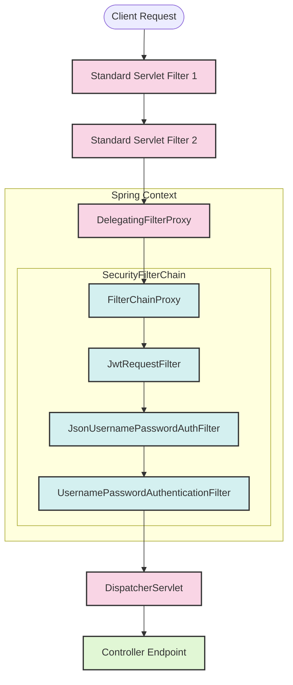

# Servlet Filters and FilterChainProxy in Component-Based Spring Security

This document covers how standard Servlet Filters, Spring's `DelegatingFilterProxy`, and `FilterChainProxy` operate under modern component-based (`use-components`) Spring Security configuration.

---

## 1. How Servlet Filters Bridge to Spring Beans

When an HTTP request hits a Spring Boot application, it must pass through two different execution environments: the **Servlet Container** (e.g., Tomcat) and the **Spring Application Context**.



### 1.1 The Bridge: `DelegatingFilterProxy`
* **The Problem**: The Servlet Container (Tomcat) loads and runs standard filters before the Spring context is initialized. Therefore, Servlet Container filters cannot natively access Spring Beans (`@Autowired`, custom services, etc.).
* **The Solution**: Spring provides **`DelegatingFilterProxy`**. This is a standard Servlet filter that registers with the container but delegates all actual work to a Spring-managed Bean implementing `jakarta.servlet.Filter`.

### 1.2 The Hub: `FilterChainProxy`
`DelegatingFilterProxy` delegates to a specific Spring bean named **`springSecurityFilterChain`** (which is an instance of **`FilterChainProxy`**).
* `FilterChainProxy` serves as the central router for Spring Security.
* It checks the incoming request path and matches it against one or more **`SecurityFilterChain`** components.
* It wraps all the internal security filters (e.g. CSRF filter, authorization filters, custom JWT filters) and executes them in precise order.

---

## 2. Component-Based `SecurityFilterChain` Registration

In modern Spring Security, we configure the filter order and behavior directly inside a `@Bean` definition within our `SecurityConfig` component:

```java
@Bean
public SecurityFilterChain filterChain(HttpSecurity http) throws Exception {
    http
        .csrf(csrf -> csrf.disable())
        .authorizeHttpRequests(auth -> auth
            .requestMatchers("/authenticate", "/login", "/public/**").permitAll()
            .anyRequest().denyAll()
        )
        .sessionManagement(session -> session.sessionCreationPolicy(SessionCreationPolicy.STATELESS));

    // Custom Component Filter Registrations
    http.addFilterBefore(jwtRequestFilter, UsernamePasswordAuthenticationFilter.class)
        .addFilterAt(jsonAuthFilter(), UsernamePasswordAuthenticationFilter.class);

    return http.build();
}
```

### Positioning Custom Filters
In a component-based setup, we use precise placement methods to insert our custom filters within the standard filter stack:

1. **`addFilterBefore(jwtRequestFilter, UsernamePasswordAuthenticationFilter.class)`**
   - **Position**: Placed immediately *before* the username/password filter.
   - **Rationale**: If a client supplies a valid Bearer JWT, we want to extract it and authenticate the request *before* any login processing or default authentication checks take place.
   
2. **`addFilterAt(jsonAuthFilter(), UsernamePasswordAuthenticationFilter.class)`**
   - **Position**: Placed *at* the same index as the standard form-login filter.
   - **Rationale**: Since this is a REST API, we replace/augment standard HTML form login with our JSON-based authentication processor (`JsonUsernamePasswordAuthFilter`).

---

## 3. Detailed Security Filter Order in Current Application

Here is the exact runtime order of the security filters active in our application, managed by `FilterChainProxy`:

```
[Tomcat Container]
      │
      ▼
DelegatingFilterProxy
      │
      ▼
FilterChainProxy (springSecurityFilterChain)
      │
 ┌────┴───────────────────────────────────────────────────────┐
 │ 1. Disable CSRF (Stateless API)                           │
 │ 2. JwtRequestFilter (Checks Authorization Header)         │
 │ 3. JsonUsernamePasswordAuthFilter (Processes /login JSON) │
 │ 4. Default UsernamePasswordAuthenticationFilter          │
 │ 5. SessionManagementFilter (STATELESS enforcement)        │
 │ 6. ExceptionTranslationFilter (AuthenticationEntryPoint)  │
 │ 7. AuthorizationFilter (Enforces URL path match rules)    │
 └────┬───────────────────────────────────────────────────────┘
      │
      ▼
DispatcherServlet ──► Controller Endpoint
```

### Why order is critical:
* **Early Terminations**: If `JwtRequestFilter` finds a valid token, it populates `SecurityContextHolder`. Downstream filters see the request is already authenticated and skip authentication.
* **Exceptions Handling**: The `ExceptionTranslationFilter` catches access-denied and authentication exceptions thrown by the rest of the chain and converts them to HTTP responses (like our custom `401 Unauthorized` entry point).
