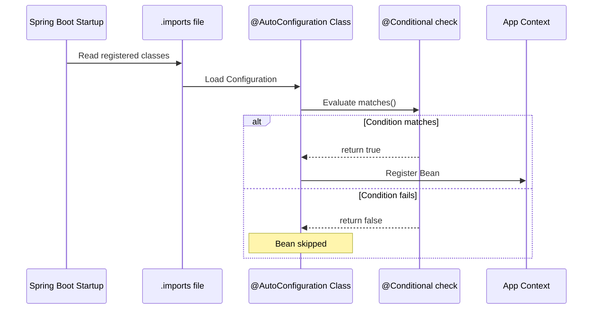

# Spring Boot: @Conditional and @AutoConfiguration

## 1. @Conditional Annotation
The `@Conditional` annotation is the foundation of Spring Boot's modularity. It determines whether a component (Bean) should be registered in the application context based on specific criteria.

### How it Works:
- It takes a class that implements the `Condition` interface.
- The `matches()` method in that class returns a `boolean`.
- **`true`**: Bean is created.
- **`false`**: Bean is ignored.

### Example: OS-Based Selection
```java
@Bean
@Conditional(WindowsCondition.class)
public MessageService windowsMessageService() {
    return new WindowsMessageService();
}
```

---

## 2. Common Conditional Annotations
Spring Boot provides pre-built annotations that are easier to use:

| Annotation | Purpose |
| :--- | :--- |
| `@ConditionalOnProperty` | Matches based on `application.properties` values. |
| `@ConditionalOnMissingBean` | Provides a **default** bean if the user hasn't defined one. |
| `@ConditionalOnClass` | Matches if a specific class is on the classpath. |
| `@ConditionalOnBean` | Matches if another specific bean already exists. |

---

## 3. @AutoConfiguration
Introduced in Spring Boot 2.7, `@AutoConfiguration` is used to group multiple bean definitions and conditions together as a module that Spring Boot can automatically load.

### Key Files:
- **Java Class**: Marked with `@AutoConfiguration`.
- **Import File**: `src/main/resources/META-INF/spring/org.springframework.boot.autoconfigure.AutoConfiguration.imports`

### Flow:
1. Spring Boot starts and reads the `.imports` file.
2. It attempts to load the listed classes.
3. It evaluates all `@Conditional` rules inside those classes.
4. It registers only the beans that pass the conditions.

---

## 4. Visual Flow Diagram


---

## 5. Benefits of @AutoConfiguration
1. **Zero-Touch Integration**: Libraries configure themselves automatically when added to the classpath. No need for `@Import` or `@ComponentScan`.
2. **Order of Execution**: Allows using `@AutoConfigureAfter` or `@AutoConfigureBefore` to control exactly when beans are created relative to other modules.
3. **Sane Defaults**: Combined with `@ConditionalOnMissingBean`, it provides default behavior that users can override simply by defining their own beans.
4. **Clean Codebase**: Keeps the main application class free of boilerplate configuration code.
5. **Separation of Concerns**: Infrastructure logic is kept separate from business logic, following the same pattern as Spring Boot's internal modules.

---

## 6. Real-World Example: External Library (JAR)
In a production environment, AutoConfiguration logic is typically stored in a separate JAR (a "Starter").

### The Library Structure:
- **`pom.xml`**: Defines the JAR's name and version.
- **`LibAutoConfiguration.java`**: Marked with `@AutoConfiguration`.
- **`META-INF/spring/*.imports`**: Registers the configuration class.

### How it is consumed:
1. The library is built and installed using `mvn install`.
2. The main project adds it as a dependency in its `pom.xml`.
3. **Magic**: At runtime, Spring Boot automatically discovers the JAR, reads the `.imports` file, and creates the beans **without the user writing a single line of configuration code.**
