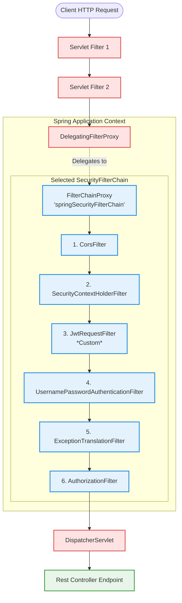

# Spring Security Filters Deep Dive

This document provides a highly detailed, professional-grade deep dive into the architecture, mechanics, and design of Spring Security filters under **Spring Security 6.x / Spring Boot 3.x**.

---

## 1. The Core Architecture: Bridging Servlet Container to Spring Context

To understand Spring Security filters, you must first understand that a Spring Boot application lives inside a **Servlet Container** (typically Tomcat), which manages the incoming TCP connections and converts them into standard `HttpServletRequest` and `HttpServletResponse` objects.

Standard Servlet Filters and Spring Beans belong to two different lifecycles:
1. **The Servlet Container**: Initializes and runs its filters (configured in `web.xml` or via `ServletContextInitializer`) *before* the Spring `ApplicationContext` is fully ready. Consequently, native Servlet filters cannot easily use Spring dependency injection (`@Autowired`).
2. **The Spring Context**: Manages standard Spring Beans (Services, Repositories, Controllers).

To bridge this gap, Spring Security uses a double-proxy design.



### 1.1 The Bridge: `DelegatingFilterProxy`
`DelegatingFilterProxy` is a standard Servlet Filter registered with the servlet container. When a request comes in:
- It does **not** perform any security checks itself.
- Instead, it acts as a lazy proxy. It looks up a specific bean named **`springSecurityFilterChain`** in the Spring Application Context and delegates all work to it.
- This delay in lookup allows the servlet container to start up first, while still letting Spring Security operate as a fully fledged Spring-managed component once the context initializes.

### 1.2 The Controller: `FilterChainProxy`
The bean named `springSecurityFilterChain` is an instance of **`FilterChainProxy`**. 
`FilterChainProxy` is the primary entry point for Spring Security's filter management. It is responsible for:
- **Managing Multiple Chains**: It contains a `List<SecurityFilterChain>`. For each request, it evaluates the request URI/headers against the `RequestMatcher` of each chain. The **first** chain that matches is the one selected to process the request.
- **Routing**: Once a `SecurityFilterChain` is selected, `FilterChainProxy` steps through that chain's filters sequentially.
- **Clearing the Security Context**: It guarantees that the `SecurityContextHolder` is cleared at the end of the request thread to prevent `ThreadLocal` memory leaks or credential leakage.

---

## 2. Anatomy of a `SecurityFilterChain`

Under the modern, component-based paradigm (Spring Security 6.x), a `SecurityFilterChain` is registered as a standalone bean:

```java
@Bean
public SecurityFilterChain securityFilterChain(HttpSecurity http) throws Exception {
    http
        .csrf(csrf -> csrf.disable())
        .authorizeHttpRequests(auth -> auth
            .requestMatchers("/api/auth/**").permitAll()
            .anyRequest().authenticated()
        )
        .sessionManagement(session -> session.sessionCreationPolicy(SessionCreationPolicy.STATELESS));

    return http.build(); // Builds and returns a DefaultSecurityFilterChain
}
```

A `SecurityFilterChain` consists of:
1. A **`RequestMatcher`**: Tells `FilterChainProxy` whether this chain should be used (e.g., `requestMatchers("/api/**")`).
2. A **`List<Filter>`**: A list of filters sorted in a strict, specific order.

---

## 3. Deep Dive: Key Built-In Filters and Their Execution Order

When a request passes through the chosen `SecurityFilterChain`, it executes a sequence of specialized filters. In Spring Security 6.x, the default stack consists of approximately 15-20 filters. Here are the most critical ones in their order of execution:

| Order | Filter Class | Responsibility |
| :--- | :--- | :--- |
| **1** | `DisableEncodeUrlFilter` | Disables the container's ability to append session IDs to URLs (prevents session hijacking via shared URLs). |
| **2** | `WebAsyncManagerIntegrationFilter` | Propagates the `SecurityContext` to async execution threads if you return `Callable` or `DeferredResult` from controllers. |
| **3** | `SecurityContextHolderFilter` | *(Critical Spring Security 6 change)* Replaced the old `SecurityContextPersistenceFilter`. It loads the security context from the `SecurityContextRepository` (e.g., HTTP Session) and puts it in the `SecurityContextHolder` at the start of the request. Unlike the old filter, **it does not automatically save the context** at the end of the request. You must save it explicitly. |
| **4** | `HeaderWriterFilter` | Injects security headers into the HTTP response (e.g., `X-Frame-Options: DENY`, `X-Content-Type-Options: nosniff`, `Content-Security-Policy`). |
| **5** | `CorsFilter` | Processes CORS preflight (`OPTIONS`) requests. Needs to be extremely early so preflight checks aren't blocked by authentication filters. |
| **6** | `CsrfFilter` | Validates a CSRF token for mutating requests (POST, PUT, DELETE, PATCH). If missing/invalid, throws an exception immediately. |
| **7** | `LogoutFilter` | Checks if the request is `/logout`. If so, clears the `SecurityContext`, invalidates the session, deletes cookies, and invokes registered `LogoutHandler`s. |
| **8** | `UsernamePasswordAuthenticationFilter` | Intercepts POST `/login`. Extracts credentials, creates an unauthenticated `UsernamePasswordAuthenticationToken`, and passes it to the `AuthenticationManager`. |
| **9** | `DefaultLoginPageGeneratingFilter` | Automatically generates the default HTML login page if you haven't declared a custom login page. |
| **10** | `BasicAuthenticationFilter` | Looks for `Authorization: Basic <base64>` header, decodes it, and authenticates the request using basic authentication. |
| **11** | `RequestCacheAwareFilter` | If a user was redirected to a login page while trying to access `/dashboard`, this filter restores `/dashboard` as the target URL after successful login. |
| **12** | `SecurityContextHolderAwareRequestFilter` | Wraps the standard servlet request to support traditional Servlet API methods like `request.isUserInRole(role)` and `request.getUserPrincipal()`. |
| **13** | `AnonymousAuthenticationFilter` | If no previous filter authenticated the request, this filter populates the `SecurityContextHolder` with an `AnonymousAuthenticationToken` (e.g., principal: `"anonymousUser"`, role: `ROLE_ANONYMOUS`). This prevents null pointer checks downstream. |
| **14** | `SessionManagementFilter` | Enforces session security policies: session fixation protection, maximum concurrent sessions, and stateless/stateful session creation rules. |
| **15** | `ExceptionTranslationFilter` | A critical safety net. It catches security-related exceptions thrown by filters down the chain (specifically by the `AuthorizationFilter`): <br/>• **If `AuthenticationException`** or **anonymous `AccessDeniedException`**: Initiates authentication (e.g., redirects to login or returns `401 Unauthorized`). <br/>• **If authenticated `AccessDeniedException`**: Invokes the `AccessDeniedHandler` (returns `403 Forbidden`). |
| **16** | `AuthorizationFilter` | *(Critical Spring Security 6 replacement for `FilterSecurityInterceptor`)* The ultimate gatekeeper. It checks whether the authenticated user has the necessary authorities/roles to access the requested URI (e.g., `hasRole("ADMIN")`). |

---

## 4. How the Filter Chain Invocation Actually Works (The Code Flow)

Filters in Java/Jakarta Servlets implement the **Chain of Responsibility** pattern. The invocation is driven by the `FilterChain.doFilter(...)` method.

### 4.1 Visualizing the Call Stack (The "U-Turn")
Execution flows forward through the filters until it reaches the `DispatcherServlet` and the controller. Once the controller returns a response, the execution flow retraces its steps backward through each filter in reverse order.

```
       Request Path ───────►                                                 ───► Controller
┌─────────────────────────┐  ┌─────────────────────────┐  ┌─────────────────────────┐
│ SecurityContextFilter   │  │ ExceptionTranslationFltr│  │   AuthorizationFilter   │
│                         │  │                         │  │                         │
│  Loads SecurityContext  │  │  try {                  │  │  Checks user's roles    │
│  into ThreadLocal       │  │    chain.doFilter(...)  │  │  and permissions.       │
│                         │  │  } catch (SecurityEx e) │  │  If invalid:            │
│  chain.doFilter(...) ───┼─►│  { handleSecurityEx() } │─►│  throws AccessDeniedEx  │
│                         │  │                         │  │                         │
│  Cleans ThreadLocal     │  │                         │  │  chain.doFilter(...)    │
└─────────────────────────┘  └─────────────────────────┘  └─────────────────────────┘
       Response Path ◄─────  ◄────────────────────────   ◄─────────────────────────
```

### 4.2 Why Exception Handling Works the Way It Does
Notice that `ExceptionTranslationFilter` is positioned *before* `AuthorizationFilter`. 
When `AuthorizationFilter` decides that a user cannot access a path, it throws a standard Java runtime exception (`AccessDeniedException`). 

Because of the chain structure, this exception travels up the call stack, right back into `ExceptionTranslationFilter`'s `catch` block:

```java
// Simplified execution inside ExceptionTranslationFilter
public void doFilter(ServletRequest request, ServletResponse response, FilterChain chain) {
    try {
        chain.doFilter(request, response); // Invokes the next filters (e.g., AuthorizationFilter)
    } catch (IOException | ServletException ex) {
        // ...
    } catch (AuthenticationException ex) {
        sendStartAuthentication(request, response, chain, ex); // Handles 401
    } catch (AccessDeniedException ex) {
        if (authenticationTrustResolver.isAnonymous(SecurityContextHolder.getContext().getAuthentication())) {
            sendStartAuthentication(request, response, chain, ex); // Redirects to login
        } else {
            accessDeniedHandler.handle(request, response, ex); // Handles 403
        }
    }
}
```

---

## 5. ThreadLocal, `SecurityContext`, and the Filter Lifecycle

Spring Security defaults to storing authentication details inside a `ThreadLocal` context via the **`SecurityContextHolder`**.

1. **Request Start (`SecurityContextHolderFilter`)**:
   Loads the security data from the database or session. It sets it in `ThreadLocal`:
   ```java
   SecurityContextHolder.setContext(securityContext);
   ```
2. **Request Execution**:
   Any piece of your application (Services, Controllers, or downstream filters) can fetch the current authenticated user at any point without passing it as a method parameter:
   ```java
   Authentication auth = SecurityContextHolder.getContext().getAuthentication();
   String currentUsername = auth.getName();
   ```
3. **Request End (`FilterChainProxy`)**:
   Once the request has finished executing (even if an unexpected exception was thrown), the filter chain ensures that the `SecurityContextHolder` is cleared:
   ```java
   SecurityContextHolder.clearContext();
   ```
   *Why is this crucial?* Servlet engines like Tomcat reuse threads from a thread pool. If the context is not cleared, thread `Tomcat-Executor-3` could process a new user's request while still holding the authentication object of the previous user. This is a severe security vulnerability.

---

## 6. Custom Filters: Implementation and Registration

When writing standard REST/Stateless APIs, you will frequently write custom filters (e.g., a `JwtRequestFilter` that reads a Bearer Token).

### 6.1 Extending `OncePerRequestFilter`
While you can implement the raw `jakarta.servlet.Filter` interface, Spring provides a utility base class called **`OncePerRequestFilter`**. 

> [!NOTE]
> Standard servlet filters can sometimes execute multiple times per request if there are internal forwards or servlet dispatches (e.g., forward to an error route `/error`). `OncePerRequestFilter` guarantees that its core logic is executed exactly **once** per request thread.

Here is a standard custom JWT validation filter:

```java
@Component
public class JwtRequestFilter extends OncePerRequestFilter {

    @Autowired
    private JwtUtil jwtUtil;

    @Autowired
    private CustomUserDetailsService userDetailsService;

    @Override
    protected void doFilterInternal(HttpServletRequest request, 
                                    HttpServletResponse response, 
                                    FilterChain filterChain) throws ServletException, IOException {
        
        final String authorizationHeader = request.getHeader("Authorization");

        String username = null;
        String jwt = null;

        if (authorizationHeader != null && authorizationHeader.startsWith("Bearer ")) {
            jwt = authorizationHeader.substring(7);
            try {
                username = jwtUtil.extractUsername(jwt);
            } catch (Exception e) {
                logger.error("Unable to extract username from token", e);
            }
        }

        // If username was extracted and security context is not yet populated
        if (username != null && SecurityContextHolder.getContext().getAuthentication() == null) {
            UserDetails userDetails = this.userDetailsService.loadUserByUsername(username);

            if (jwtUtil.validateToken(jwt, userDetails)) {
                UsernamePasswordAuthenticationToken authenticationToken = 
                    new UsernamePasswordAuthenticationToken(userDetails, null, userDetails.getAuthorities());
                
                authenticationToken.setDetails(new WebAuthenticationDetailsSource().buildDetails(request));
                
                // Populate the Security Context
                SecurityContextHolder.getContext().setAuthentication(authenticationToken);
            }
        }

        // Continue the chain to next filter
        filterChain.doFilter(request, response);
    }
}
```

### 6.2 Registering the Custom Filter inside `SecurityFilterChain`
To tell Spring Security where to run your custom filter, you configure it inside your filter chain bean:

```java
@Bean
public SecurityFilterChain securityFilterChain(HttpSecurity http) throws Exception {
    http
        .csrf(csrf -> csrf.disable())
        // ... other configuration ...
        
        // Registering JwtRequestFilter BEFORE the traditional UsernamePasswordAuthenticationFilter
        .addFilterBefore(jwtRequestFilter, UsernamePasswordAuthenticationFilter.class);

    return http.build();
}
```

* **`addFilterBefore(Filter filter, Class<? extends Filter> beforeFilter)`**: Places it immediately before the specified built-in class.
* **`addFilterAfter(Filter filter, Class<? extends Filter> afterFilter)`**: Places it immediately after.
* **`addFilterAt(Filter filter, Class<? extends Filter> atFilter)`**: Inserts it at the exact order index of the specified filter. (Note: This does not *replace* the target filter, it just matches its index. To disable a default filter, you configure it via `http` properties e.g., `formLogin(form -> form.disable())`).

### 6.3 The Spring Boot "Double Execution" Trap (Crucial Gotcha)

> [!WARNING]
> If you annotate a custom filter with `@Component` or `@Bean`, Spring Boot's servlet auto-registration engine will detect it and automatically register it as a **global Servlet Filter**.
> 
> If you also reference this bean in `.addFilterBefore(jwtRequestFilter, ...)` inside your `SecurityFilterChain`, the filter will execute **twice**! Once outside the Spring Security proxy (as a global container filter) and once inside the Spring Security filter chain.

#### How to fix the double execution trap:
If you want to prevent Spring Boot from auto-registering the filter as a servlet filter, register a `FilterRegistrationBean` inside your configuration and set its `enabled` property to `false`:

```java
@Bean
public FilterRegistrationBean<JwtRequestFilter> registration(JwtRequestFilter filter) {
    FilterRegistrationBean<JwtRequestFilter> registration = new FilterRegistrationBean<>(filter);
    registration.setEnabled(false); // Prevents Spring Boot from registering it globally in the container
    return registration;
}
```

---

## 7. Summary Checklist of the Request Lifecycle

1. **Client** makes an HTTP request to a protected endpoint `/api/dashboard`.
2. Tomcat receives the request and executes its registered servlet filters.
3. The request hits `DelegatingFilterProxy`, which looks up the `springSecurityFilterChain` bean.
4. `FilterChainProxy` matches the request with a matching `SecurityFilterChain`.
5. `SecurityContextHolderFilter` checks if the user has an active session. If not, it establishes an empty `SecurityContext`.
6. Custom `JwtRequestFilter` intercepts the request:
   - Finds the Bearer token in the `Authorization` header.
   - Extracts the username and verifies the signature.
   - Sets a fully authenticated `UsernamePasswordAuthenticationToken` directly inside the `SecurityContextHolder`.
7. `ExceptionTranslationFilter` opens a `try-catch` block.
8. `AuthorizationFilter` checks the URL configuration: `/api/dashboard` requires `ROLE_USER`.
   - It reads the `SecurityContextHolder`, finds the authenticated user, sees they have `ROLE_USER`, and permits passage.
9. The request exits Spring Security's proxy chain.
10. `DispatcherServlet` routes the request to your Spring Controller.
11. The controller returns a response.
12. The response travels back up through the filters.
13. `FilterChainProxy` cleans up the `ThreadLocal` context using `SecurityContextHolder.clearContext()`.
14. The client receives the response.
