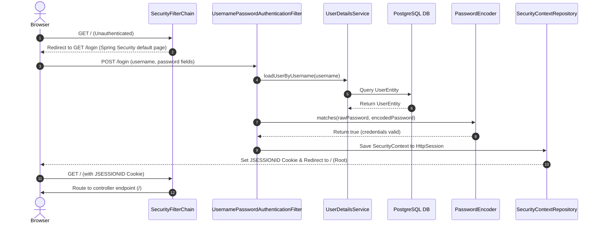
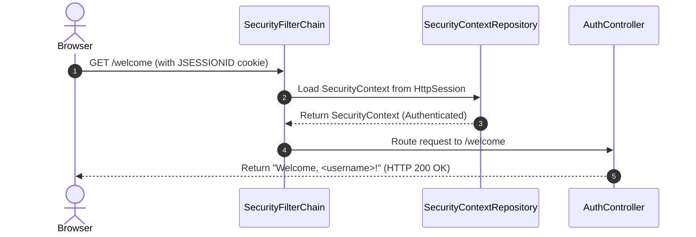

# Stateful Form-Based Login Security Flow (Direct Route Mapping)

This document details the active, production-ready stateful form-based authentication flow implemented on this branch, explaining how it manages user identity using HTTP Sessions and secure browser cookies, rendering the greeting directly on the root landing URL.

---

## 1. Login & Session Creation Flow

This flow executes when an unauthenticated client attempts to access a protected page, is redirected to the sign-in form, and submits credentials.

### Flow Diagram



### Steps in Detail
1. **Unauthenticated Check**: The browser requests the root landing path `/`. Spring Security intercepts the call and redirects the client to the generated sign-in form path `/login`.
2. **Credentials POST**: The user submits the HTML form, issuing a `POST /login` containing `username` and `password` parameters as form-encoded fields (`application/x-www-form-urlencoded`).
3. **Filter Interception**: Spring Security's native `UsernamePasswordAuthenticationFilter` intercepts the request.
4. **User Lookup & Match**: The filter calls `UserDetailsService` to fetch the user from PostgreSQL and validates the password hash using the `BCryptPasswordEncoder` bean.
5. **Session Bind**: Upon success, a `SecurityContext` is created, bound to a stateful `HttpSession`, and saved in the HTTP session repository.
6. **Cookie Response**: The server issues a `JSESSIONID` cookie in the HTTP headers and redirects the client to the root path (`/`).
7. **Direct Rendering**: Because `/` is mapped directly to the greeting endpoint, the server directly renders `"Welcome, <username>!"` to the browser without any extra HTTP 302 redirections.

---

## 2. Subsequent Authenticated Request Flow

This flow executes for every subsequent request targeting protected resources, leveraging the standard `JSESSIONID` cookie.

### Flow Diagram



### Steps in Detail
1. **Cookie Inspection**: The browser automatically attaches the `JSESSIONID` session cookie to the headers of the outgoing request to `/welcome` (or `/`).
2. **Session Retrieval**: Spring Security's `SecurityContextHolderFilter` reads the cookie, fetches the corresponding `HttpSession` from memory, and populates the `SecurityContextHolder`.
3. **Route Allowed**: Spring Security recognizes the user is successfully authenticated and routes the request downstream to the controller.
4. **Name Extraction**: `AuthController.welcome()` extracts the username directly from the injected `Authentication` session principal and returns the greeting.

---

## 3. Minimal Stateful Security Configuration

No JWT utilities, filters, or programmatic authentication managers are required. All security operations are configured natively in Spring Security:

### A. Security Mappings Configuration
```java
@Configuration
@EnableWebSecurity
public class SecurityConfig {

    @Autowired
    private UserRepository repo;

    @Bean
    public UserDetailsService userDetailsService() {
        return username -> {
            UserEntity user = repo.findByUsername(username)
                    .orElseThrow(() -> new UsernameNotFoundException("User Not Found"));
            return User.builder()
                    .username(user.getUsername())
                    .password(user.getPassword())
                    .roles("USER")
                    .build();
        };
    }

    @Bean
    public PasswordEncoder passwordEncoder() {
        return new BCryptPasswordEncoder();
    }

    @Bean
    public SecurityFilterChain securityFilterChain(HttpSecurity http) throws Exception {
        http
            .csrf(csrf -> csrf.disable()) // CSRF disabled for easier testing
            .authorizeHttpRequests(auth -> auth
                    .anyRequest().authenticated()
            )
            .formLogin(Customizer.withDefaults()); // Enable standard Form-Based Login redirect and processing

        return http.build();
    }
}
```

### B. MVC Welcome Controller (No Redirection)
```java
@RestController
public class AuthController {

    @GetMapping({"/", "/welcome"})
    public String welcome(Authentication authentication) {
        // Extract the username statelessly from the Spring Security session context
        return "Welcome, " + authentication.getName() + "!";
    }
}
```

---

## 4. Architectural Tradeoffs

| Pros | Cons |
| :--- | :--- |
| **0 Extra HTTP 302 Redirections**: Renders the landing screen immediately after form login succeeds. | **Stateful scaling bottleneck**: Requires server memory to store HTTP sessions (or centralized sessions like Spring Session Redis). |
| **Out-of-the-box browser friendliness**: Browsers automatically manage session cookies, making it perfect for standard monoliths/MVC apps. | Susceptible to Cross-Site Request Forgery (CSRF) unless CSRF protection is enabled. |
| **0 Custom Security Boilerplate**: No filters, claims signing, or JWT token builders to configure or maintain. | Less suited for decoupled microservice architectures or distributed APIs. |
