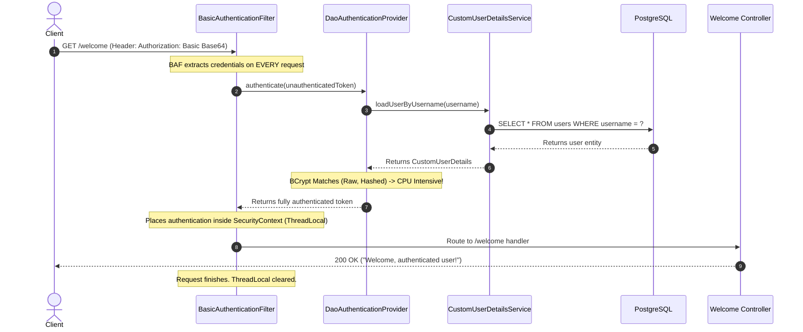

# Subsequent Request Flow in Stateless HTTP Basic Authentication

This document details the lifecycle, execution flow, performance implications, and optimization techniques for subsequent client requests in a stateless HTTP Basic authentication environment under Spring Security 6.x.

---

## 1. The Core Rule of Stateless Security

By configuring `SessionCreationPolicy.STATELESS` in Spring Security:
* The server **never** creates an `HttpSession` for the user.
* The server **never** returns a session cookie (such as `JSESSIONID`).
* The server **retains zero state** about the client once a request completes.

Consequently, the client **must submit the `Authorization: Basic <base64>` header with every single subsequent request**.

---

## 2. Subsequent Request Lifecycle Flow

When a client makes a subsequent request (e.g., calling the protected endpoint `/welcome` after having previously logged in):



### Steps of Execution:
1. **Header Inspection**: `BasicAuthenticationFilter` intercepts the request and detects the `Authorization` header.
2. **Credentials Extraction**: The username and password are decoded from the base64-encoded header value.
3. **Database & BCrypt Validation**:
   * The filter invokes `AuthenticationManager.authenticate()`, which delegates validation to the `DaoAuthenticationProvider`.
   * The provider queries the PostgreSQL database via your `CustomUserDetailsService` to fetch the user details.
   * It performs the CPU-heavy `PasswordEncoder.matches()` validation (computing the BCrypt hash of the incoming password and comparing it to the database hash).
4. **Context Seeding**: Upon successful validation, the authenticated token is set in the `SecurityContextHolder` (using a `ThreadLocal` context) for the **duration of this request thread only**.
5. **Controller Routing**: The request is routed to the corresponding Controller (e.g. `/welcome`), executing the business logic.
6. **Thread Cleanup**: As the request completes, the `ThreadLocal` context is completely cleared to prevent credential leakage.

---

## 3. The Performance Problem & Solutions

Because stateless basic auth executes the database query and BCrypt checks on **every single request**, two primary bottlenecks arise:
1. **Database Spikes**: High volume of select queries to the `users` table.
2. **CPU Exhaustion**: BCrypt is intentionally resource-intensive. Computing BCrypt hashes continuously on active APIs will exhaust CPU resources.

---

## 4. Optimization Strategies

### Solution A: Enable Stateful Sessions (Cookie-Based Session Persistence)
For standard web-based clients (such as browsers), you can switch from stateless to stateful session management:

```java
// In SecurityConfig.java
.sessionManagement(session -> session.sessionCreationPolicy(SessionCreationPolicy.IF_REQUIRED))
```

* **How it works**:
  * On the **first** request, Spring Security validates the Basic credentials via the database and BCrypt, creates an `HttpSession`, and returns a `JSESSIONID` cookie.
  * On **subsequent** requests, the browser sends the `JSESSIONID` cookie.
  * The `SecurityContextHolderFilter` intercepts the cookie, loads the session directly from memory, and populates the `SecurityContext`—**completely bypassing database queries and BCrypt checks**.

---

### Solution B: Caching Layer (Stateless Caching)
If your API must remain entirely stateless (e.g., for REST microservices), you can implement an in-memory caching layer (e.g., using **Redis**, **Hazelcast**, or **Ehcache**) on your `UserDetailsService`:

```java
@Service
public class CustomUserDetailsService implements UserDetailsService {

    @Autowired
    private UserRepository userRepository;

    @Override
    @Cacheable(value = "users", key = "#username") // Caches UserDetails in memory
    public UserDetails loadUserByUsername(String username) throws UsernameNotFoundException {
        User userEntity = userRepository.findByUsername(username)
                .orElseThrow(() -> new UsernameNotFoundException("User not found: " + username));
        return new CustomUserDetails(userEntity);
    }
}
```

* **How it works**:
  * Subsequent lookups for `loadUserByUsername` fetch the pre-authenticated user details straight from the memory cache (e.g. Redis), saving database roundtrips.
