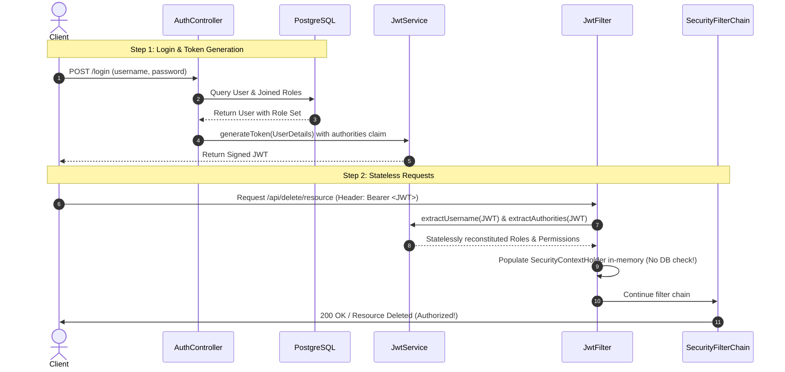

# Detailed Guide: Database-Backed Stateless RBAC & Authorization in Spring Security

This document covers the complete architecture, implementation, and configurations of a production-grade, stateless Role-Based Access Control (RBAC) and Permission-Based Access Control system using Spring Boot, JPA/Hibernate, PostgreSQL, and JSON Web Tokens (JWT).

---

## 1. Architectural Overview

In a typical monolithic application, user roles and permissions are queried from the database on every HTTP request. While simple, this approach imposes a heavy database overhead.

In a **Stateless RBAC** architecture:
1. **Authentication**: During the `/login` phase, the database is queried once. The user's dynamic roles (e.g., `ROLE_ADMIN`, `ROLE_USER`) and associated granular permissions (e.g., `OP_READ`, `OP_DELETE`) are loaded.
2. **Token Generation**: These roles and permissions are packed as a custom claim (e.g., `"authorities"`) inside a signed JSON Web Token (JWT).
3. **Stateless Propagation**: On subsequent requests, the application decodes and validates the JWT. The user's security context (containing roles and authorities) is reconstituted **entirely in-memory** from the token's claims, completely bypassing database checks.
4. **Access Control**: Authorization rules are evaluated dynamically using standard path matchers or method-level annotations.



---

## 2. Database Schema Design (Many-to-Many RBAC)

To support dynamic RBAC, we define a standard relational schema using two main entities: `UserEntity` and `RoleEntity`, mapped through a join table `user_roles`.

### 2.1 Role Entity (`roles` Table)
Represents a user role in the system.

```java
package com.hipradeep.code.entity;

import jakarta.persistence.Entity;
import jakarta.persistence.GeneratedValue;
import jakarta.persistence.GenerationType;
import jakarta.persistence.Id;
import jakarta.persistence.Table;
import lombok.AllArgsConstructor;
import lombok.Data;
import lombok.NoArgsConstructor;

@Data
@Entity
@Table(name = "roles")
@NoArgsConstructor
@AllArgsConstructor
public class RoleEntity {

    @Id
    @GeneratedValue(strategy = GenerationType.IDENTITY)
    private Long id;

    private String name; // e.g., "ROLE_USER", "ROLE_ADMIN"
}
```

### 2.2 User Entity (`user_entity` Table)
Maps the user and maps their multiple roles through the `user_roles` join table.

```java
package com.hipradeep.code.entity;

import jakarta.persistence.Entity;
import jakarta.persistence.Id;
import jakarta.persistence.Table;
import jakarta.persistence.ManyToMany;
import jakarta.persistence.JoinTable;
import jakarta.persistence.JoinColumn;
import jakarta.persistence.FetchType;
import lombok.AllArgsConstructor;
import lombok.Data;
import lombok.NoArgsConstructor;
import java.util.Set;
import java.util.HashSet;

@Data
@Entity
@Table(name = "user_entity")
@NoArgsConstructor
@AllArgsConstructor
public class UserEntity {

    @Id
    private Long id;

    private String username;
    private String password;

    @ManyToMany(fetch = FetchType.EAGER)
    @JoinTable(
        name = "user_roles",
        joinColumns = @JoinColumn(name = "user_id"),
        inverseJoinColumns = @JoinColumn(name = "role_id")
    )
    private Set<RoleEntity> roles = new HashSet<>();
}
```

---

## 3. JWT Claims Mapping & Stateless Reconstitution

### 3.1 Packing Claims (`JwtService`)
When generating the token, we extract the user's granted authorities (roles + permissions) and pack them as a signed list claim:

```java
public String generateToken(UserDetails userDetails) {
    Map<String, Object> claims = new HashMap<>();
    claims.put("authorities", userDetails.getAuthorities().stream()
            .map(GrantedAuthority::getAuthority)
            .toList());
    return generateToken(claims, userDetails.getUsername());
}

@SuppressWarnings("unchecked")
public List<String> extractAuthorities(String token) {
    Claims claims = extractAllClaims(token);
    return claims.get("authorities", List.class);
}
```

### 3.2 Parsing Claims (`JwtFilter`)
On incoming requests, we extract the authorities claim and reconstruct the security context without querying the database:

```java
if (username != null && SecurityContextHolder.getContext().getAuthentication() == null) {
    if (!jwtService.isTokenExpired(jwt)) {
        List<String> roles = jwtService.extractAuthorities(jwt);
        List<GrantedAuthority> authorities = roles == null ? Collections.emptyList() :
                roles.stream()
                     .map(SimpleGrantedAuthority::new)
                     .collect(Collectors.toList());

        UserDetails userDetails = User.builder()
                .username(username)
                .password("") // Password is not required for stateless context
                .authorities(authorities)
                .build();

        UsernamePasswordAuthenticationToken authToken = new UsernamePasswordAuthenticationToken(
                userDetails,
                null,
                authorities
        );
        authToken.setDetails(new WebAuthenticationDetailsSource().buildDetails(request));
        SecurityContextHolder.getContext().setAuthentication(authToken);
    }
}
```

---

## 4. Path-Based and Annotation-Based Security

### 4.1 Path-Based Security Configurations
Configured inside the `SecurityFilterChain` bean. This maps static route endpoints to security requirements:

```java
@Bean
public SecurityFilterChain securityFilterChain(HttpSecurity http) throws Exception {
    http
        .csrf(csrf -> csrf.disable())
        .authorizeHttpRequests(auth -> auth
                .requestMatchers("/login", "/api/public/**").permitAll() // 1. permitAll()
                .requestMatchers("/api/admin/**").hasRole("ADMIN") // 2. Role-Based Path Security
                .requestMatchers("/api/delete/**").hasAuthority("OP_DELETE") // 3. Permission-Based Path Security
                .requestMatchers("/api/private/**").authenticated() // 4. authenticated()
                .requestMatchers("/api/restricted/**").denyAll() // 5. denyAll()
                .anyRequest().authenticated()
        )
        .sessionManagement(session -> session.sessionCreationPolicy(SessionCreationPolicy.STATELESS))
        .addFilterBefore(jwtFilter, UsernamePasswordAuthenticationFilter.class);

    return http.build();
}
```

### 4.2 Annotation-Based Method Security
By enabling method security using `@EnableMethodSecurity(securedEnabled = true, jsr250Enabled = true)`, you can protect Java service or controller methods directly.

#### A. `@PreAuthorize`
Uses SpEL (Spring Expression Language) to perform advanced checks prior to method execution:
```java
@GetMapping("/method/preauthorize-role")
@PreAuthorize("hasRole('ADMIN')")
public String preAuthorizeRole() {
    return "Access Granted for ADMIN";
}

@GetMapping("/method/preauthorize-permission")
@PreAuthorize("hasAuthority('OP_DELETE')")
public String preAuthorizePermission() {
    return "Access Granted for OP_DELETE permission";
}
```

#### B. `@Secured`
A legacy, Spring-specific annotation. It requires the exact role string prefix (e.g., `ROLE_`):
```java
@GetMapping("/method/secured")
@Secured("ROLE_USER")
public String securedRole() {
    return "Access Granted for ROLE_USER";
}
```

#### C. `@RolesAllowed`
A JSR-250 standard annotation. Does not require the `ROLE_` prefix:
```java
@GetMapping("/method/rolesallowed")
@RolesAllowed("ADMIN")
public String rolesAllowed() {
    return "Access Granted for JSR-250 ADMIN";
}
```

---

## 5. Summary of Key Security Directives

| Security Directive | Type | Purpose / Description |
| :--- | :--- | :--- |
| `permitAll()` | Path-level | Allows public access without authentication (e.g., login, swagger, register endpoints). |
| `authenticated()` | Path-level | Requires a valid authenticated session/token, regardless of what roles or permissions the user holds. |
| `denyAll()` | Path-level | Blocks access to all requests, making the path completely inaccessible. |
| `hasRole(String role)` | Path/Method | Grants access if the user has the specified role (Spring checks for `ROLE_` prefix automatically). |
| `hasAuthority(String perm)`| Path/Method | Grants access if the user has a specific granular permission string (e.g., `OP_DELETE`). |
| `@PreAuthorize` | Method-level | Strong, highly flexible SpEL-based access checking (supports logical operators like `AND` / `OR`). |
| `@Secured` | Method-level | Simpler, Spring-specific annotation targeting a list of role strings directly. |
| `@RolesAllowed` | Method-level | Standard JSR-250 annotation enabling standard framework portability. |
